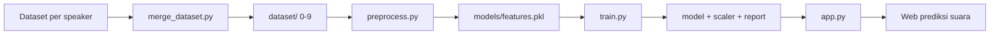

# ASR Project — Klasifikasi Angka 0-9
PTU · Teknik Informatika · ITENAS Bandung

Project ini adalah sistem pengenalan suara untuk mengklasifikasikan rekaman angka 0 sampai 9. Alurnya dimulai dari penggabungan dataset beberapa speaker, preprocessing audio menjadi fitur MFCC, training model klasifikasi, lalu inferensi melalui web app Flask.

## Gambaran Alur



## Alur Proses

1. **Merge dataset**
   - Dataset dari beberapa folder speaker digabung ke folder `dataset/`.
   - Nama file dinormalisasi dan dipetakan ke kelas angka 0–9.

2. **Preprocessing audio**
   - Audio dibaca dengan `librosa`.
   - Noise reduction dilakukan pada tahap preprocessing dataset.
   - Silence di-trim, audio dinormalisasi, lalu dipotong atau dipad ke durasi tetap.
   - Fitur yang diambil adalah MFCC, delta, dan delta-delta.

3. **Training model**
   - Data fitur dibagi menjadi train dan test.
   - Fitur dinormalisasi dengan `StandardScaler`.
   - Model klasifikasi dilatih menggunakan `SVC`.
   - Hasil evaluasi disimpan ke folder `models/runs/<timestamp>/`.

4. **Inferensi web**
   - User merekam suara dari mikrofon selama 2 detik.
   - Audio dikirim ke endpoint Flask `/api/predict`.
   - Model mengembalikan prediksi angka dan confidence.

## Struktur Folder

```text
ASR/
├── app.py                  # Flask web app untuk inferensi
├── preprocess.py           # Ekstraksi fitur MFCC dari dataset
├── preprocessdataset.py    # Merge dan normalisasi dataset speaker
├── train.py                # Training model klasifikasi
├── requirements.txt        # Daftar dependency
├── dataset/                # Dataset gabungan siap diproses
│   ├── 0/
│   ├── 1/
│   ├── 2/
│   └── ...
├── dataset_farras/         # Dataset mentah per speaker
├── dataset_felix/
├── dataset_rael/
├── dataset_rifki/
├── models/
│   └── runs/
│       └── <timestamp>/    # Output training per percobaan
├── static/
│   ├── css/style.css
│   └── js/main.js
└── templates/
    └── index.html
```

## Cara Menjalankan

### 1. Install dependency

```bash
pip install -r requirements.txt
```

### 2. Siapkan dataset mentah

Taruh rekaman audio per speaker ke dalam folder seperti berikut:

```text
dataset_farras/
  0/
  01/
  02/
  ...
dataset_felix/
  0/
  01/
  ...
```

Setelah itu jalankan script merge agar semua data masuk ke format standar `dataset/0` sampai `dataset/9`.

```bash
python preprocessdataset.py
```

### 3. Jalankan preprocessing fitur

```bash
python preprocess.py
```

Output:

- `models/features.pkl`

### 4. Training model

```bash
python train.py
```

Output training disimpan ke folder seperti:

- `models/runs/<timestamp>/svm_model.pkl`
- `models/runs/<timestamp>/scaler.pkl`
- `models/runs/<timestamp>/classification_report.txt`
- `models/runs/<timestamp>/confusion_matrix.png`
- `models/runs/<timestamp>/f1_per_class.png`
- `models/runs/<timestamp>/cv_scores.png`

### 5. Jalankan web app

```bash
python app.py
```

Buka:

- `http://localhost:5000`

## Fitur Web App

- Rekam suara langsung dari mikrofon selama 2 detik.
- Kirim audio ke backend Flask untuk diprediksi.
- Tampilkan angka hasil prediksi.
- Tampilkan confidence dan top-5 kelas teratas.

## Detail Preprocessing

- Sample rate: `16000 Hz`
- Durasi target audio: `2 detik`
- MFCC: `20 koefisien`
- Turunan fitur: `delta` dan `delta-delta`
- Statistik fitur: `mean` dan `std`

Secara total, setiap sampel audio diubah menjadi vektor fitur fixed-length yang cocok untuk model klasifikasi tradisional seperti SVM.

## Model Yang Dipakai

- **Algoritma**: SVM (`scikit-learn`)
- **Kernel**: `rbf`
- **Class weight**: `balanced`
- **Probabilistic output**: aktif, supaya bisa menampilkan confidence dan top-5 prediksi

## Endpoint API

### POST `/api/predict`

Upload audio lalu sistem mengembalikan hasil prediksi.

Form data:

- `audio`: file audio (`webm` atau `wav`)

Contoh response:

```json
{
  "success": true,
  "prediction": "5",
  "confidence": 87.34,
  "top5": [
    {"label": "5", "probability": 87.34},
    {"label": "3", "probability": 7.12},
    {"label": "8", "probability": 2.44}
  ]
}
```

### GET `/api/status`

Memeriksa apakah model sudah berhasil dimuat.

Response contoh:

```json
{ "model_loaded": true }
```

## Catatan Penting

Saat ini ada perbedaan jalur output model antara `train.py` dan `app.py`:

- `train.py` menyimpan model ke `models/runs/<timestamp>/`
- `app.py` membaca file dari `models/asr_model.pkl` dan `models/scaler.pkl`

Artinya, setelah training, file model terbaik perlu disalin atau path di `app.py` disesuaikan supaya web app bisa membaca hasil training terbaru.

## Dependensi Utama

- Flask
- librosa
- noisereduce
- scikit-learn
- numpy
- soundfile
- tqdm
- pydub
- matplotlib

## Ringkasan Singkat

1. Gabungkan dataset speaker ke `dataset/`.
2. Jalankan `preprocess.py` untuk membuat fitur.
3. Jalankan `train.py` untuk melatih model.
4. Jalankan `app.py` untuk membuka web prediksi suara.
